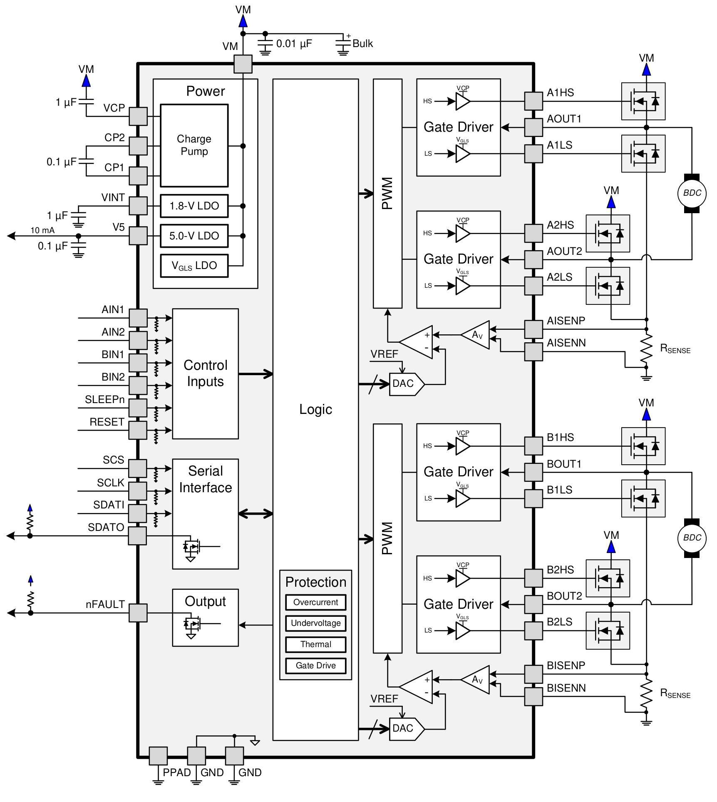
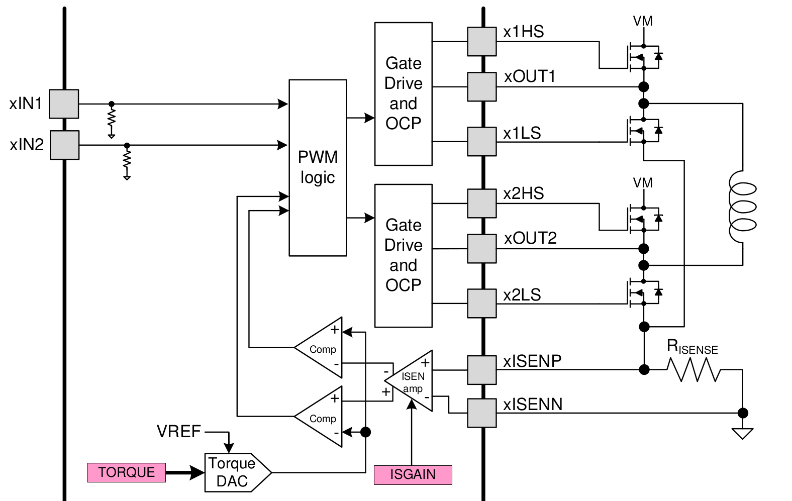
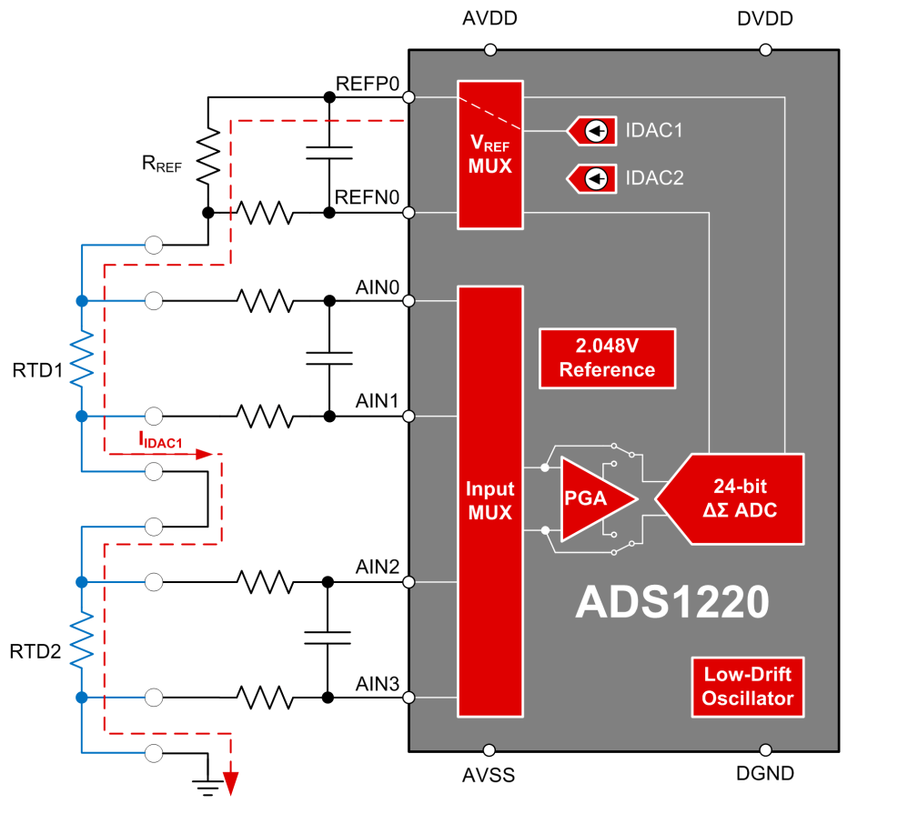
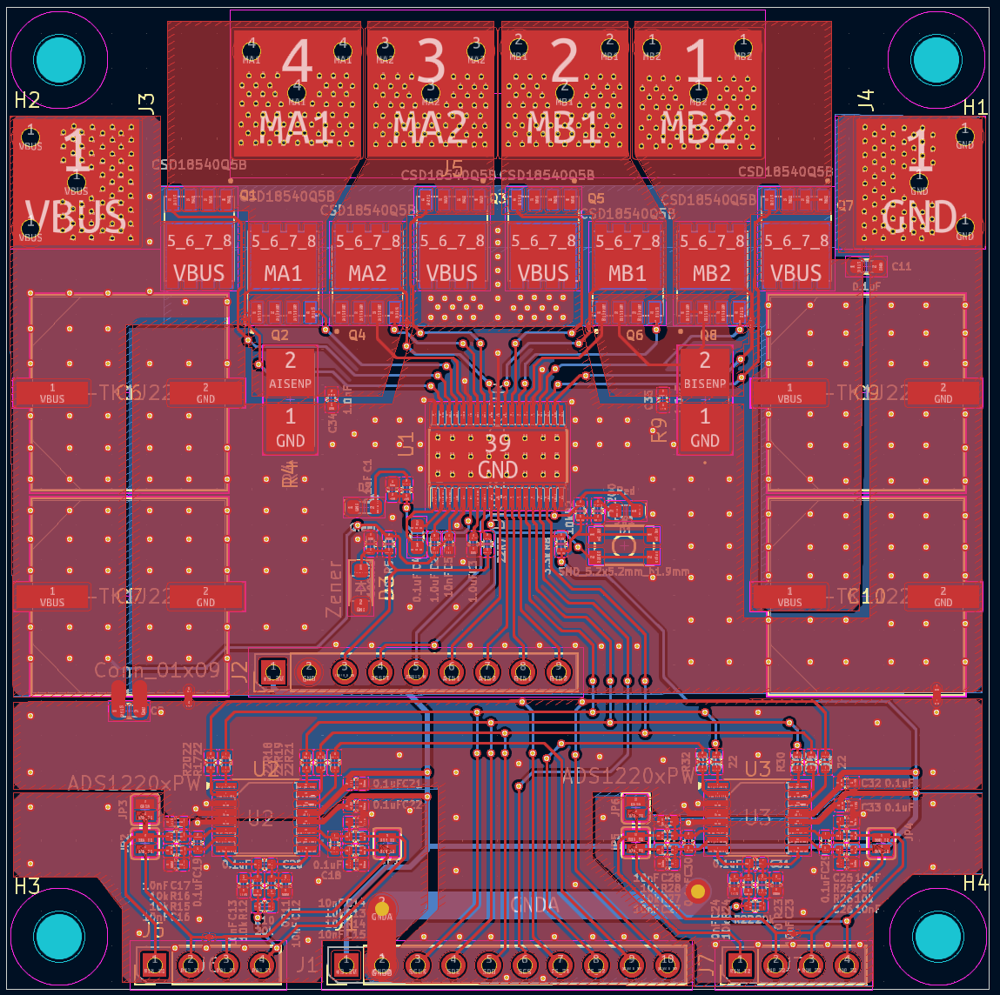
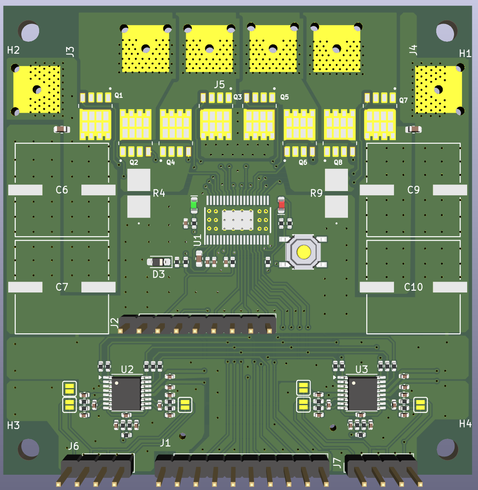
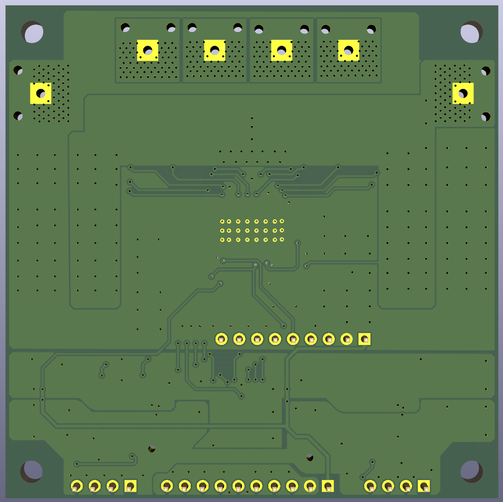

# Power Brick

The Power Brick can control power to resistive heater, thermo electric cooler/heater or DC motor.
It requires 8V or larger input and might be able to handle 30A (4 oz copper).

## Two Channel DC Power Controller.
  - DRV8704 FET driver
  -  8..52V
  -  SPI interface for  monitoring
  -  PWM 500kHz
  -  CSD18540Q5B FET 30 / 400A (peak)

[Datasheet Driver](./datasheets/drv8704.pdf)
[Datasheet FET](./datasheets/csd18540q5b.pdf)

### Overview

### Control Logic

## 2x Two Channel Precision Thermistor ADC
  - ADS1220
  - Configured for two channel 10K NTC thermistor measurements using internal current source and external reference 22k resistor.

[Datasheet ADS1220](./datasheets/ads1220.pdf)

This design requires that both temperature sensors are attached. If one is not populated, the measurement circuit is interrupted and no temperature is reported.

## Power Brick PCB Design

The following files were created for this project using KiCad.

